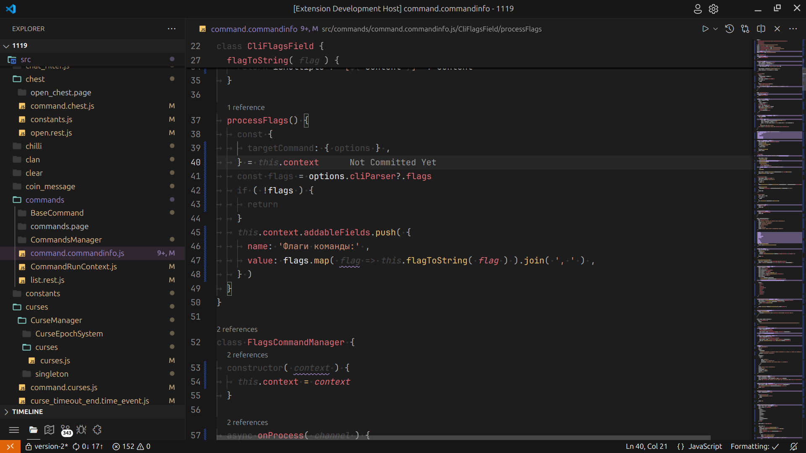
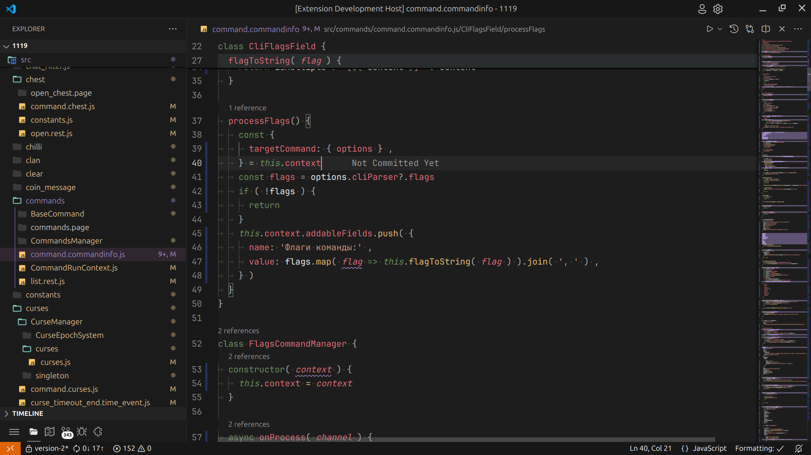

# Adventure theme 
Highlight comments, but dim keywords and operators using purple instead of red for errors.

Concentration vatiant:

Balanced variant

## Thanks!
Started from https://themes.vscode.one/

Fork default theme from https://themes.vscode.one/user/alexsuriano

Used free icon from https://www.flaticon.com/free-icon/orange_135620

## Theme tested on next languages
Rust, TS/JS, CSS, HTML/JSX